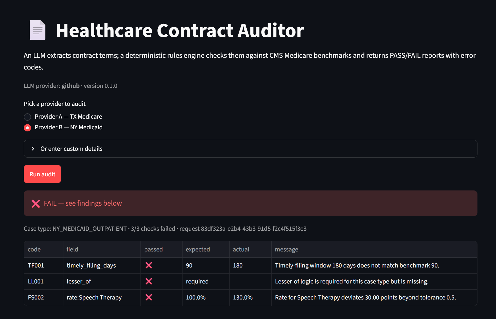
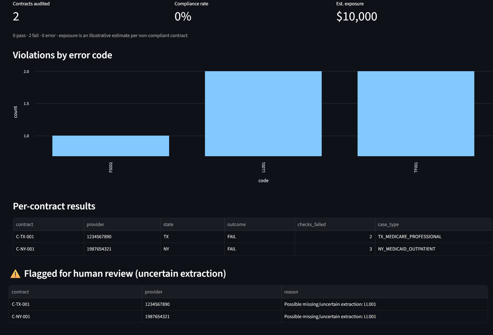
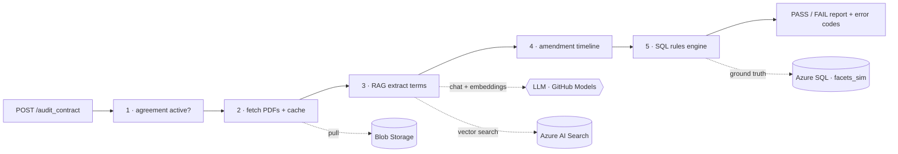

# Healthcare Contract Auditor

An AI-powered REST API that audits healthcare **provider contract PDFs** against CMS
Medicare Physician Fee Schedule data, producing a PASS/FAIL JSON report with structured
error codes (`TF001` timely filing, `FS002` fee-schedule deviation, `LL003` lesser-of, …).

**The AI proposes, the SQL disposes.** An LLM only *extracts* contract values into
validated Pydantic JSON; a deterministic SQL rules engine does the financial comparison —
so there is no hallucination risk on regulated dollar figures.

> Portfolio project. Built from public CMS data and a generic architectural pattern.
> Sample contracts under `data/contracts/` are **synthetic** and clearly labelled.

## The business problem

Healthcare payer operations teams manually read 30–50 page provider agreements and
cross-check internal fee tables to confirm negotiated rates and filing rules match
regulatory benchmarks — typically **30–60 minutes per contract** and error-prone at scale.
This service automates that audit: a coded **PASS/FAIL** report in seconds, with every
finding traced to the exact contract clause and the benchmark it was checked against.

- **Who it's for:** payer ops / provider-contracting / compliance teams.
- **What it produces:** structured findings with error codes (`TF001`, `FS002`, `LL003`, …)
  and a verifiable audit trail — safe to use on regulated financial figures.
- **Portfolio dashboard:** audit a whole book of contracts at once → **% compliant**, top
  violation types, **estimated $ exposure**, and which contracts need human review.

## Demo

Two views — a **single-contract audit** and a **portfolio dashboard** (compliance %,
violations by error code, estimated $ exposure, and items flagged for human review).






Runs locally with Streamlit (UI) or Uvicorn (JSON API), and is containerized via the
included `Dockerfile` for Azure App Service — see [SETUP.md](SETUP.md) §5.

## Try it locally (3 steps)

```powershell
# 1. create + activate a virtual env  (macOS/Linux: source .venv/bin/activate)
python -m venv .venv; .\.venv\Scripts\Activate.ps1
# 2. install deps, then put your GITHUB_TOKEN in the new .env
pip install -r requirements.txt; Copy-Item .env.example .env
# 3. launch the demo UI  (or: uvicorn app:app --reload  for the JSON API at /docs)
streamlit run streamlit_app.py
```

## Architecture — a 5-stage pipeline behind `POST /audit_contract`



1. **Pre-check** — verify the provider agreement is active (`facets_sim.provider_agreement`).
2. **Retrieval & cache** — find contract PDFs (`app_config.meta_index`), pull from Blob,
   check the response cache keyed on `(doc_hash, prompt_hash, provider)`.
3. **AI extraction** — RAG over Azure AI Search; extract Timely Filing, Lesser-of, and
   reimbursement rates into Pydantic models via forced tool-calling.
4. **Timeline** — reconcile effective/terminate dates across amendments.
5. **Strict grader** — map to one of 6 case types; parameterized SQL audit against
   `facets_sim`; emit coded findings and persist to `app_config.audit_runs`.

## LLM provider matrix

All LLM/embedding calls go through `agents/llm_client.py`. Switch backends with one env
var — no code changes:

| `LLM_PROVIDER`  | Role               | base_url                                | Key env            | Default model              |
| --------------- | ------------------ | --------------------------------------- | ------------------ | -------------------------- |
| `github` (def.) | Primary (dev/demo) | `https://models.inference.ai.azure.com` | `GITHUB_TOKEN`     | `gpt-4o-mini`              |
| `azure`         | Production target  | `AZURE_OPENAI_ENDPOINT` (+ deployment)  | `AZURE_OPENAI_KEY` | `AZURE_OPENAI_DEPLOYMENT`  |
| `groq`          | High-throughput    | `https://api.groq.com/openai/v1`        | `GROQ_API_KEY`     | `llama-3.3-70b-versatile`  |

## Tech stack

Python 3.12 target, FastAPI, Uvicorn · **Streamlit** (demo UI) · LangChain-style RAG ·
Azure AI Search (vectors) · Azure SQL (`facets_sim` + `app_config` schemas, async via
`aioodbc`) · Azure Blob · **Docker + Azure App Service** · `ruff` · `pytest`.

## Quick start

```powershell
python -m venv .venv
.\.venv\Scripts\Activate.ps1          # macOS/Linux: source .venv/bin/activate
pip install -r requirements.txt
Copy-Item .env.example .env           # then add your GITHUB_TOKEN
uvicorn app:app --reload              # REST API:  http://127.0.0.1:8000  (/health, /docs)
streamlit run streamlit_app.py        # or the visual demo UI
```

See **[SETUP.md](SETUP.md)** for the full credentials + Azure provisioning walkthrough.

## Development

```powershell
pip install -r requirements-dev.txt   # ruff, pytest (one-time)
ruff check .                          # lint
ruff format --check .                 # formatting
pytest                                # 52 unit tests (live tests skipped)
pytest -m live                        # opt-in live LLM smoke test (needs GITHUB_TOKEN)
```

## Evaluation — how accurate is the extraction?

The LLM *proposes* values, so its extraction accuracy is measured, not assumed. A labeled
set of synthetic contract excerpts (`evals/dataset.jsonl`) is run through the real extraction
and scored per field, with precision/recall for the binary lesser-of check:

```powershell
python -m evals.run_eval        # needs GITHUB_TOKEN; writes evals/results.md
```

This catches exactly the kind of reliability gap that motivates the design: **the AI
proposes, but the deterministic SQL rules engine is the source of truth.** See
[evals/results.md](evals/results.md) for the latest scores.

## Project layout

```
app.py                     FastAPI routes + lifespan (builds the pipeline)
streamlit_app.py           Streamlit demo UI (runs the pipeline, shows the report)
pipeline.py                5-stage orchestration (AuditPipeline)
models.py                  Pydantic v2 schemas (extraction, timeline, report, error codes)
config.py                  Settings (pydantic-settings), version, .env loading
agents/
  llm_client.py            Provider abstraction: chat_structured() + embed()  ← only LLM entry point
  agent_rag.py             RAG retrieval, DB prompt registry, response cache, extraction
document_extraction/
  pdf_ingest.py            PDF → Blob → chunk → embed → AI Search
  blob_store.py            Azure Blob wrapper
  search_index.py          Azure AI Search vector index (write + read)
  timeline_builder.py      Amendment reconciliation
facets/
  fee_extraction.py        Normalize/dedupe AI output, map terminology to codes
  multi_records.py         Regex provider-type standardization, facility inference
  fee_validation.py        Strict grader: 6 case types, parameterized SQL, error codes
db/
  database.py              Async aioodbc connection pool
  repository.py            Typed repositories (parameterized SQL only)
  schema_facets_sim.sql    CMS/Facets ground-truth DDL
  schema_app_config.sql    App-state DDL (cache, prompts, audit runs)
  seed_mpfs.py             Load data/mpfs_2025.csv into facets_sim.mpfs_fee
  seed_reference.py        Seed agreements, benchmarks, prompt registry (Python)
  seed_data.sql            Same seed via plain sqlcmd (no Python/driver needed)
reporting.py               Portfolio aggregation (dashboard metrics)
evals/                     Accuracy eval — labeled dataset + metrics + runner
Dockerfile                 Container image (bundles ODBC Driver 18) for Azure App Service
data/                      Synthetic contracts (PDF) + sample MPFS CSV
tests/                     pytest mirrors the source tree
```

## Verification status

| Check                                              | Status |
| -------------------------------------------------- | ------ |
| `ruff check` / `ruff format --check`               | ✅ pass |
| `pytest` (52 unit tests, mocked Azure/LLM)         | ✅ pass |
| App boots, `/health` returns the right shape       | ✅ pass |
| Streamlit UI imports, synthetic PDFs parse         | ✅ pass |
| Extraction-accuracy eval ([results](evals/results.md)) | ✅ 86% overall (numeric fields 100%) |
| Live LLM, AI Search, Blob, Azure SQL (end-to-end audit) | ✅ verified on Azure |
| Azure App Service container deployment             | ⏳ optional (see [SETUP.md](SETUP.md) §5) |

## Notes

- **Python** 3.12 target (ruff pinned to `py312`); runs on 3.12 or 3.13.
- The LLM HTTP client verifies against the OS trust store, so it works behind
  TLS-inspecting proxies.
